CleanEntry: A KMP Case Study
CleanEntry is a Kotlin Multiplatform (KMP) application built to demonstrate a modern, scalable, and
maintainable app architecture. It serves as a case study for implementing Clean Architecture
principles with an MVI (Model-View-Intent) pattern, sharing logic and UI across Android, iOS, Desktop, and Web (via Kotlin/WasmJs).

The project features a complete user authentication flow, including:

- User Registration (First Name, Surname, Email, Phone Number)
- User Login (Phone Number, Password)
- A native SwiftUI Country Code Picker on iOS
- Form Validation
- An offline-first data layer for countries

## 📖 Documentation

- [**Case Study: A Deep Dive**](Case_Study.md): A detailed explanation of the project's architecture
  and patterns.

- [**Technologies & Rationale**](Technologies.md): An overview of why each key technology and
  library was chosen for this project.


## 📸 Screenshots

| Screen                  | Android                                           | IOS                                           |
|-------------------------|---------------------------------------------------|-----------------------------------------------|
| **Login**               | 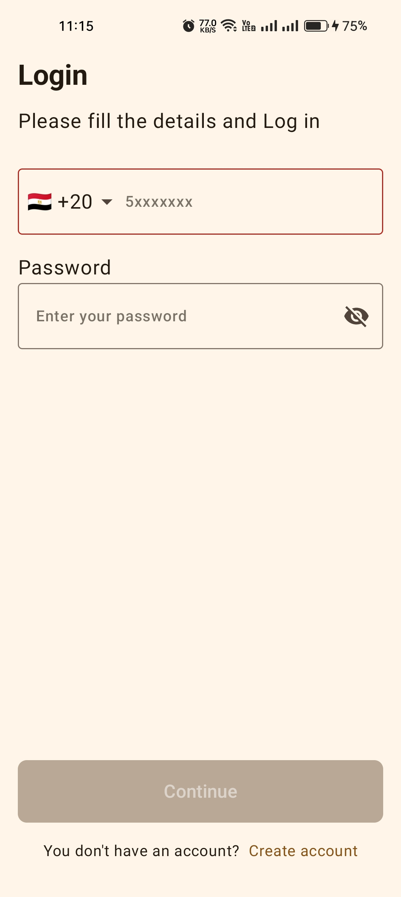               | 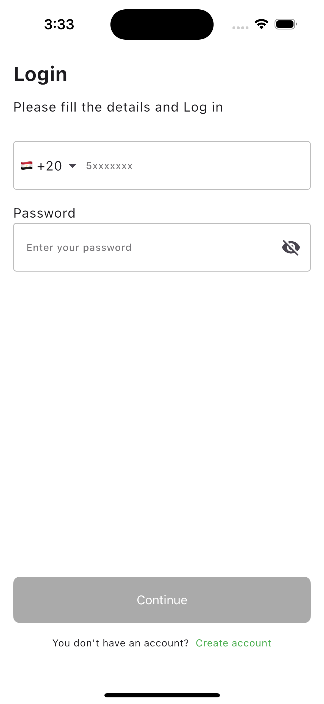               |
| **Login Dark**          | 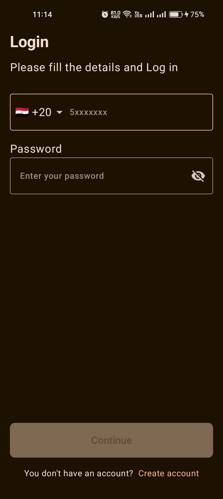          | 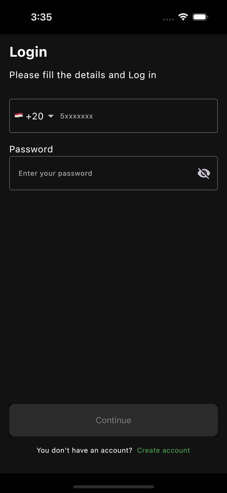          |
| **Registration**        | 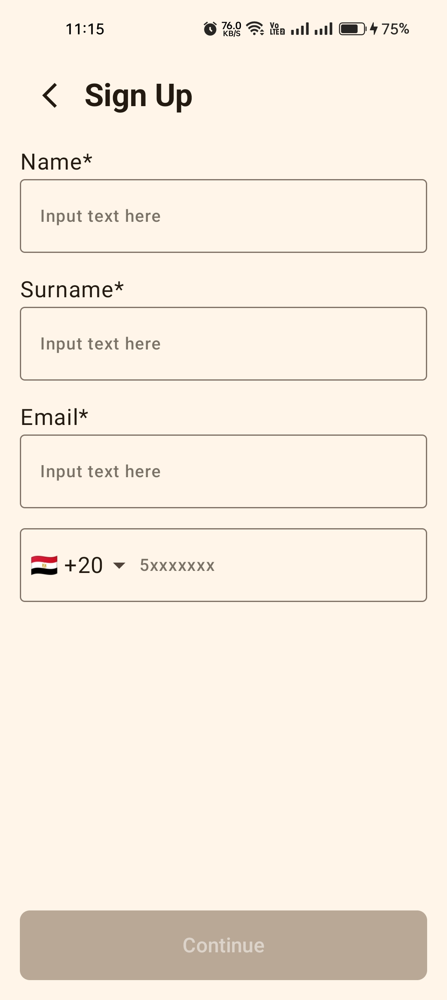              | 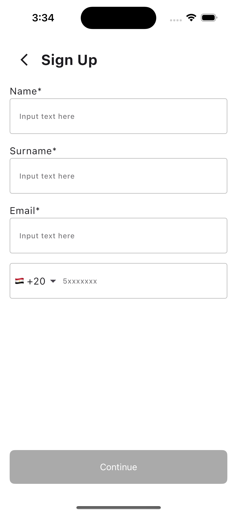              |
| **Registration Dark**   | 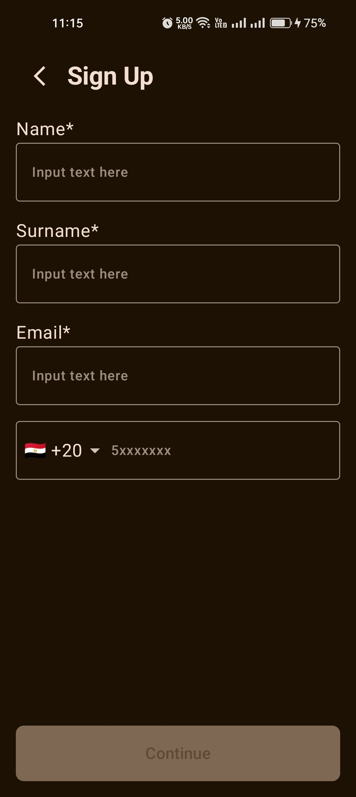         | 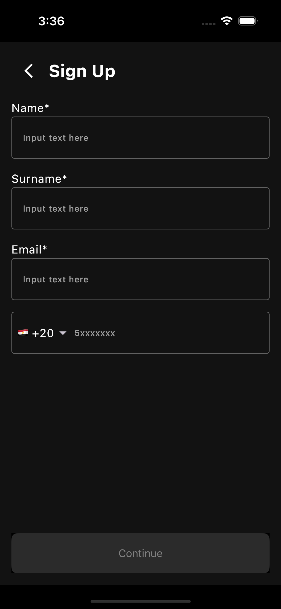         |
| **Country Picker**      | 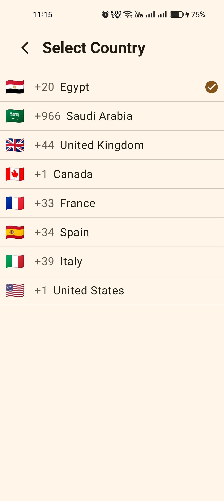      | 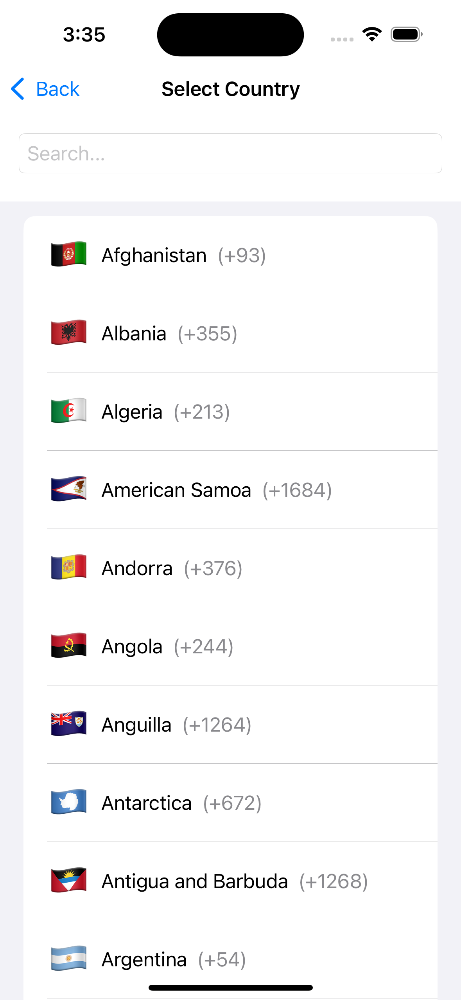      |
| **Country Picker Dark** | 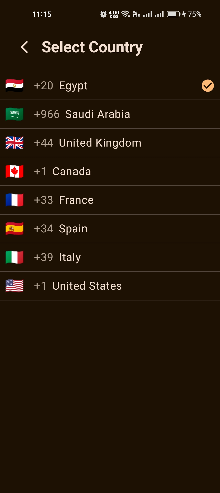 |  |

| Screen             | Light Mode                                 | Dark Mode                                       |
|--------------------|--------------------------------------------|-------------------------------------------------|
| **Login**          | 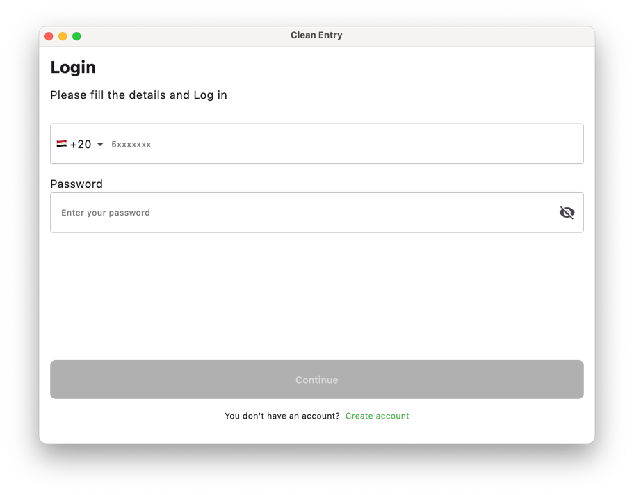          | 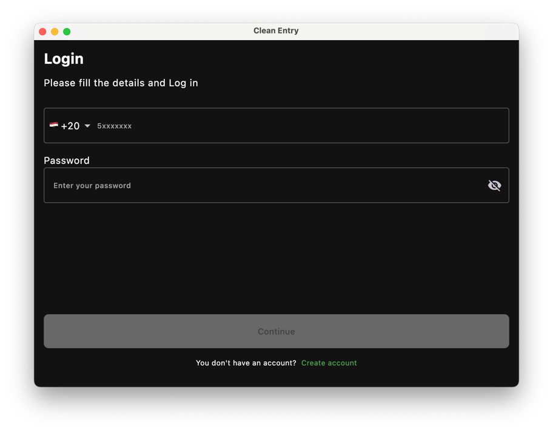          |
| **Registration**   | 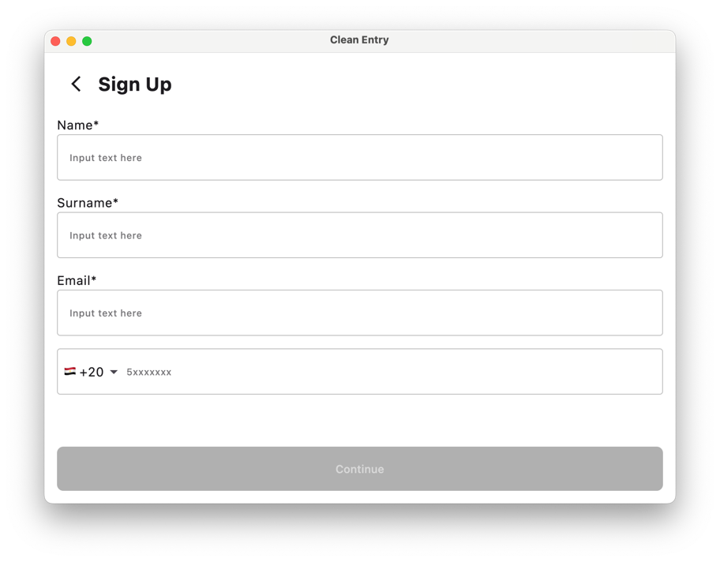         | 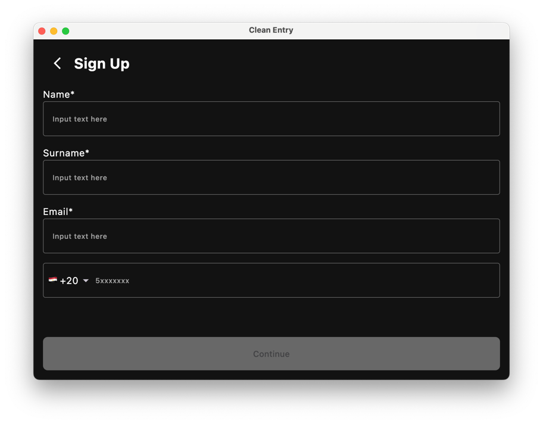         |
| **Country Picker** | 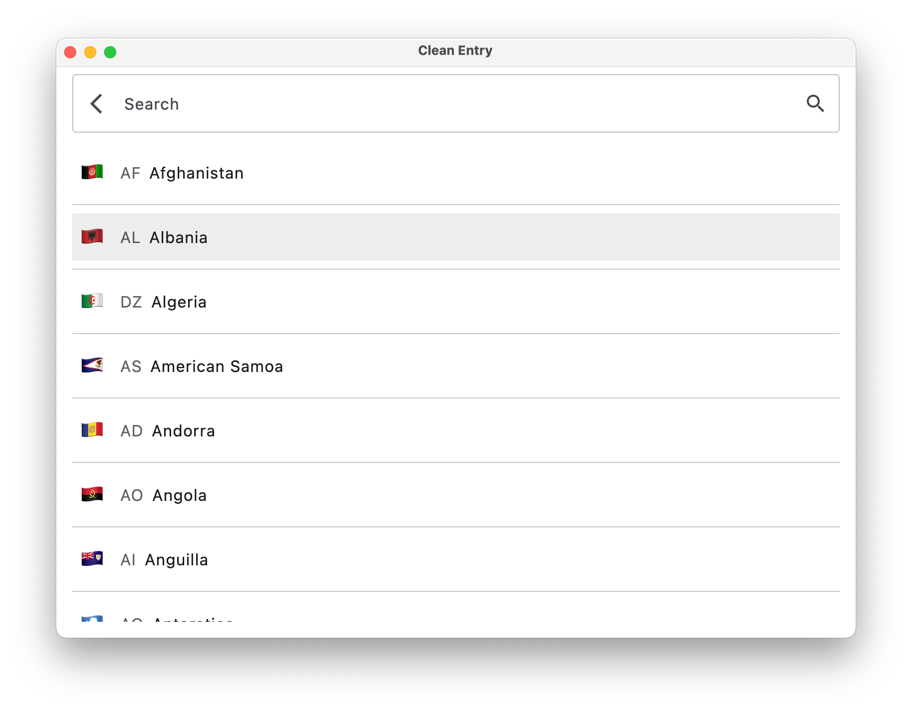 | 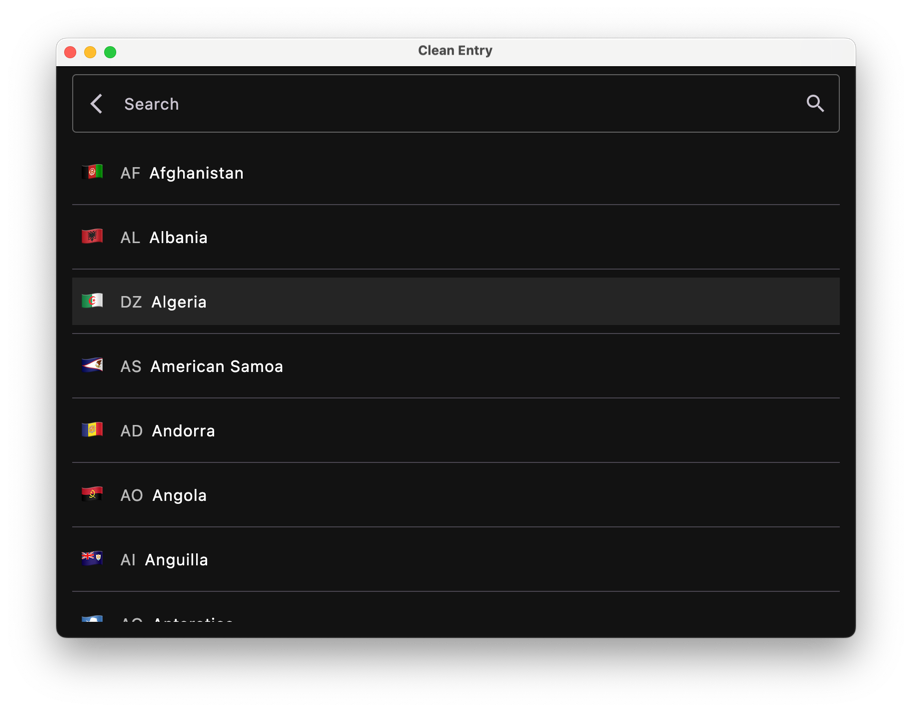 |

Web (WasmJs) screenshots can be added here once available.

## 🛠️ Tech Stack & Key Concepts

- Kotlin Multiplatform: For sharing code across Android, iOS, Desktop, and Web (via Kotlin/WasmJs).

- Compose Multiplatform: For the Android, Desktop, and Web (WasmJs) UI, and for shared screens hosted on iOS.

- SwiftUI: For the native iOS UI shell, navigation, and specific screens.

- Clean Architecture: A clear separation between Presentation, Domain, and Data layers in the shared
  composeApp module.

- MVI (Model-View-Intent): A reactive, unidirectional data flow pattern for the presentation layer.

- Koin: For dependency injection across all platforms.

- Apollo GraphQL: For multiplatform networking.

- Room: For offline caching on Android & Desktop, provided via an expect/actual pattern.

- expect/actual: For implementing platform-specific features like the database and phone number
  validation.

## 🏛 Architecture:

The project follows Clean Architecture principles to create a separation of concerns, making the app
highly scalable, maintainable, and testable.

- **Clean Architecture:**A clear separation between Presentation, Domain, and Data layers.
- **MVI (Model-View-Intent):**A reactive, unidirectional data flow pattern for the presentation
  layer.
- **Multi-Module:**The app is split into logical`core`and`composeApp`modules.

## **Design:**

- **Design System:**A centralized`core`module provides reusable UI components, colors, typography,
  and spacing.

### Module Structure

The project is organized into several modules, each with a distinct responsibility.

```
📁 CleanEntry/
├── 📁 composeApp/
│   ├── 📁 src/
│   │   ├── 📂 commonMain/
│   │   │   └── 📁 feature_auth/
│   │   │           ├── 📂 data/
│   │   │           ├── 📂 di/
│   │   │           ├── 📂 domain/
│   │   │           │   ├── 📂 model/
│   │   │           │   └── 📂 usecase/
│   │   │           ├── 📂 navigation/
│   │   │           └── 📂 presentation/
│   │   │               ├── 📂 login/
│   │   │               └── 📂 registration/
│   │   ├── 📂 androidMain/
│   │   │   ├── 📂 navigation/
│   │   │   └── 📁 feature_auth/
│   │   │           ├── 📂 navigation/
│   │   │           └── 📂 presentation/
│   │   │               └── 📂 country_code_picker/
│   │   ├── 📂 iosMain/
│   │   │   ├── 📂 navigation/
│   │   │   └── 📁 feature_auth/
│   │   │           ├── 📂 navigation/
│   │   │           └── 📂 presentation/
│   │   │               └── 📂 country_code_picker/
│   │   ├── 📂 jvmMain/  
│   │   │   ├── 📂 navigation/
│   │   │   └── 📁 feature_auth/
│   │   │           ├── 📂 navigation/
│   │   │           └── 📂 presentation/
│   │   │               └── 📂 country_code_picker/
│   │   ├── 📂 nonJsMain/
│   │   │   └── 📂 ...
│   │   ├── 📂 commonTest/
│   │   │   └── 📂 ...
│   │   └── 📂 wasmJsMain/
│   │       └── 📂 ...
│   ├── 📄 build.gradle.kts
│   └── 📄 countries.db
├── 📁 core/
│   ├── 📂 commonMain/
│   │   ├── 📂 designsystem/
│   │   ├── 📂 mvi/
│   │   ├── 📂 components/
│   │   └── 📂 util/
│   ├── 📂 androidMain/...
│   ├── 📂 iosMain/...
│   └── 📂 jvmMain/...
└── 📁 iosApp/ (Native iOS Application)
```

- `:core` - A foundational module containing code shared across all feature modules. This includes
  the Design System, MVI base classes, and common utilities. It has no knowledge of any specific
  feature.

- `:composeApp` - The shared Kotlin Multiplatform module. It contains all the shared code, including
  the domain and data layers, ViewModels, and the shared Compose UI for Android, Desktop, and Web (WasmJs).

- `:iosApp` - The native iOS application. It is written primarily in SwiftUI and is responsible for
  the overall app structure, navigation, and hosting the shared Compose UI screens.

### Presentation Layer: MVI

The presentation layer uses the MVI (Model-View-Intent) pattern to manage state and ensure a predictable, unidirectional data flow.

- **`BaseViewModel`**: An abstract `ViewModel` that provides a consistent structure for all ViewModels. It manages the event-handling loop and the channel for one-time side effects (`Effects`).

- **`Reducer`**: Each feature has a `Reducer` object (e.g., `LoginReducer`, `RegistrationReducer`). This is a pure function responsible for taking the current state and an event, and producing a new state. This enforces the principle that state mutations are centralized and predictable.

- **`Route` & `Screen`**: Each screen is split into two composables:

    - The **`Route`** is the stateful component. It connects to the `ViewModel`, collects the state, and handles side effects like navigation.

    - The **`Screen`** is the stateless component. It only knows how to display the UI based on the state it's given and how to emit events back to the `Route`. This makes it highly reusable and easy to test with Jetpack Compose Previews.


### Navigation

Navigation is handled within each feature module to make them self-contained.

- **Type-Safe Destinations**: The `feature_auth` module defines its own navigation graph in `AuthNavHost.kt` and its destinations in the `AuthDestination.kt` sealed class. This makes navigation within the feature type-safe and independent of the main app.

- **Returning Results**: The `CountryCodePickerScreen` uses the `NavController`'s `SavedStateHandle` to return the selected country data back to the previous screen (Login or Registration). This is the modern, recommended way to handle screen results in Jetpack Compose.


## 🧪 Testing

The project includes a suite of unit tests to ensure the logic is correct and prevent regressions.

- **Domain Layer**: UseCases are tested with pure JUnit tests to verify the business logic.

- **Presentation Layer**: Reducers are tested to ensure state transitions are correct. ViewModels are tested using MockK and Turbine to mock dependencies and verify state emissions and side effects.


## 🚀 Getting Started
To build and run the project:

- Clone the repository.
- Open the project in Android Studio.
- Sync the Gradle files.
- To run on Android, select the composeApp run configuration.
- To run on iOS, open the iosApp in Xcode and run it on a simulator or device.
- To run on Desktop, select the desktop run configuration in Android Studio.
- To run on Web (WasmJs), execute the Gradle task `./gradlew wasmJsBrowserDevelopmentRun` (or a similar task defined in your `build.gradle.kts`) and open the displayed URL (usually `http://localhost:8080`) in your browser.
