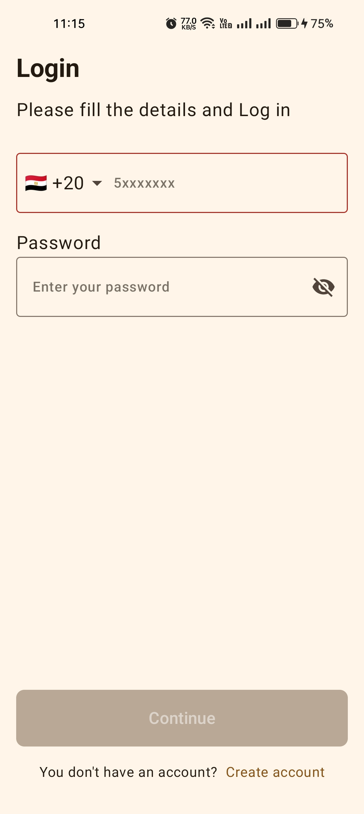
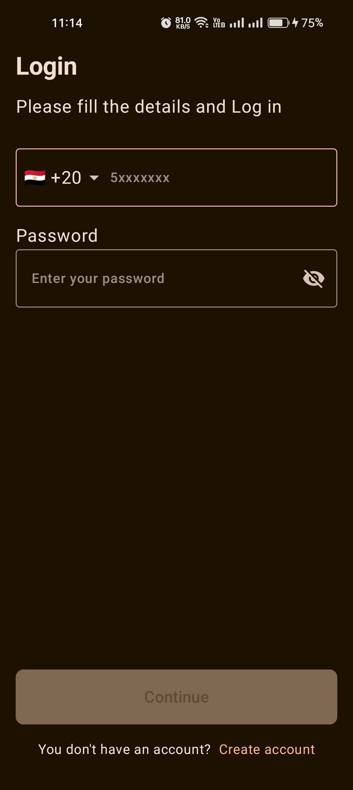
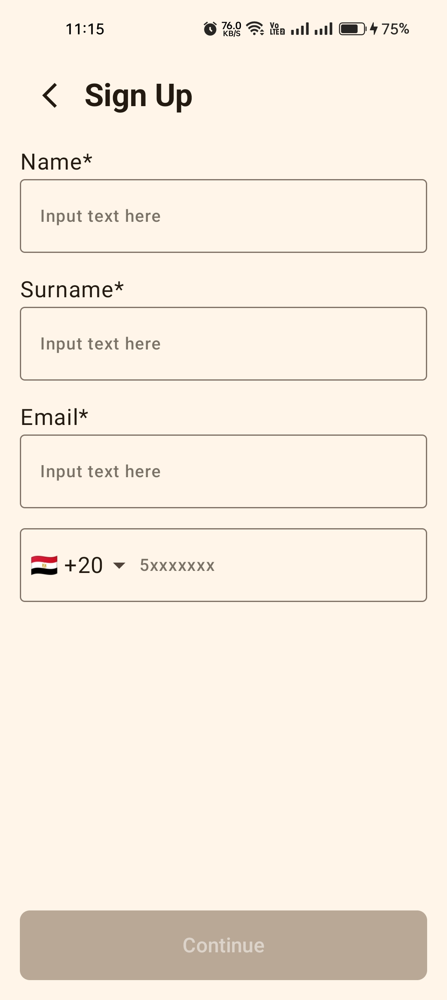
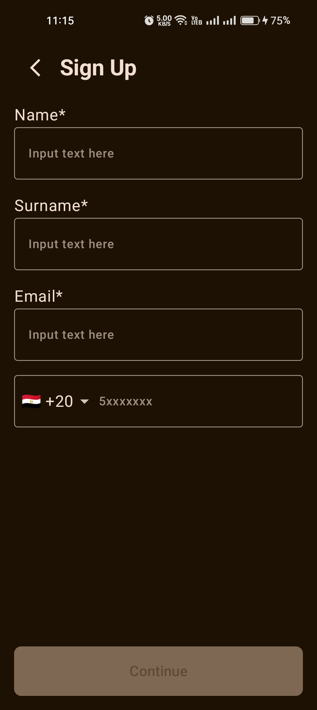

# CleanEntry: A Clean Architecture & MVI Case Study

CleanEntry is a sample Android application built to demonstrate a modern, scalable, and maintainable app architecture. It serves as a case study for implementing Clean Architecture principles with an MVI (Model-View-Intent) pattern in a multi-module project using Jetpack Compose.

The project features a complete user authentication flow, including:

- User Registration (First Name, Surname, Email, Phone Number)

- User Login (Phone Number, Password)

- Country Code Picker

- Form Validation


## 📖 Documentation

- [**Case Study: A Deep Dive**](https://www.google.com/search?q=./CASE_STUDY.md "null"): A detailed explanation of the project's architecture and patterns.

- [**Technologies & Rationale**](https://www.google.com/search?q=./TECHNOLOGIES.md "null"): An overview of why each key technology and library was chosen for this project.


## 📸 Screenshots


| Screen             | Light Mode              | Dark Mode               |
|--------------------|-------------------------|-------------------------|
| **Login**          |  |  |
| **Registration**   |  |  |
| **Country Picker** |  |  |

## 🛠️ Tech Stack & Key Concepts

- **Tech Stack:**

    - [Kotlin](https://kotlinlang.org/ "null") + [Coroutines](https://kotlinlang.org/docs/coroutines-overview.html "null") & [Flow](https://kotlinlang.org/docs/flow.html "null") for asynchronous operations.

    - [Jetpack Compose](https://developer.android.com/jetpack/compose "null") for the entire UI layer.

    - [Koin](https://insert-koin.io/ "null") for dependency injection.

    - [Compose Navigation](https://developer.android.com/jetpack/compose/navigation "null") for a type-safe navigation system.

    - [libphonenumber-android](https://github.com/MichaelRocks/libphonenumber-android "null") for robust phone number validation.

- **Architecture:**

    - **Clean Architecture:** A clear separation between Presentation, Domain, and Data layers.

    - **MVI (Model-View-Intent):** A reactive, unidirectional data flow pattern for the presentation layer.

    - **Multi-Module:** The app is split into logical `core` and `feature` modules.

- **Design:**

    - **Design System:** A centralized `core` module provides reusable UI components, colors, typography, and spacing.


## 🏛️ Architecture

The project follows Clean Architecture principles to create a separation of concerns, making the app highly scalable, maintainable, and testable.

### Module Structure

The project is organized into several modules, each with a distinct responsibility.

```
📁 CleanEntry/
├── 📁 app/
│   ├── 📂 navigation/
│   ├── 📂 di/
│   └── 📄 MainActivity.kt
│
├── 📁 core/
│   ├── 📂 designsystem/
│   ├── 📂 mvi/
│   ├── 📂 components/
│   └── 📂 util/
│
└── 📁 feature_auth/
    ├── 📂 data/
    ├── 📂 di/
    ├── 📂 domain/
    │   ├── 📂 model/
    │   └── 📂 usecase/
    ├── 📂 navigation/
    └── 📂 presentation/
        ├── 📂 login/
        ├── 📂 registration/
        └── 📂 country_code_picker/
```

- `:app` - The main application module. It is responsible for tying all the modules together, setting up the main navigation graph, and initializing app-wide components like Koin.

- `:core` - A foundational module containing code shared across all feature modules. This includes the Design System, MVI base classes, and common utilities. It has no knowledge of any specific feature.

- `:feature_auth` - A self-contained feature module responsible for the entire authentication flow (Login, Registration, Country Code Picker).


### Presentation Layer: MVI

The presentation layer uses the MVI (Model-View-Intent) pattern to manage state and ensure a predictable, unidirectional data flow.

- **`BaseViewModel`**: An abstract `ViewModel` that provides a consistent structure for all ViewModels. It manages the event-handling loop and the channel for one-time side effects (`Effects`).

- **`Reducer`**: Each feature has a `Reducer` object (e.g., `LoginReducer`, `RegistrationReducer`). This is a pure function responsible for taking the current state and an event, and producing a new state. This enforces the principle that state mutations are centralized and predictable.

- **`Route` & `Screen`**: Each screen is split into two composables:

    - The **`Route`** is the stateful component. It connects to the `ViewModel`, collects the state, and handles side effects like navigation.

    - The **`Screen`** is the stateless component. It only knows how to display the UI based on the state it's given and how to emit events back to the `Route`. This makes it highly reusable and easy to test with Jetpack Compose Previews.


### Navigation

Navigation is handled within each feature module to make them self-contained.

- **Type-Safe Destinations**: The `feature_auth` module defines its own navigation graph in `AuthNavHost.kt` and its destinations in the `AuthDestination.kt` sealed class. This makes navigation within the feature type-safe and independent of the main app.

- **Returning Results**: The `CountryCodePickerScreen` uses the `NavController`'s `SavedStateHandle` to return the selected country data back to the previous screen (Login or Registration). This is the modern, recommended way to handle screen results in Jetpack Compose.


## 🧪 Testing

The project includes a suite of unit tests to ensure the logic is correct and prevent regressions.

- **Domain Layer**: UseCases are tested with pure JUnit tests to verify the business logic.

- **Presentation Layer**: Reducers are tested to ensure state transitions are correct. ViewModels are tested using MockK and Turbine to mock dependencies and verify state emissions and side effects.


## 🚀 Getting Started

To build and run the project:

1. Clone the repository.

2. Open the project in Android Studio.

3. Sync the Gradle files.

4. Run the `app` configuration on an emulator or a physical device.