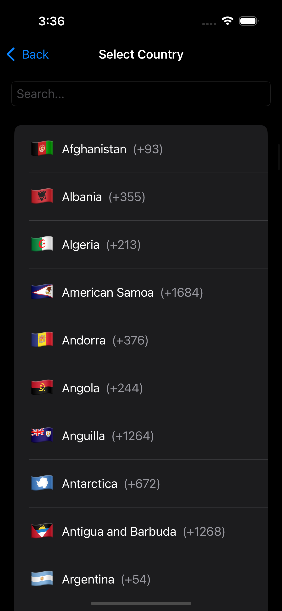

# CleanEntry: A KMP Case Study
CleanEntry is a Kotlin Multiplatform (KMP) application built to demonstrate a modern, scalable, and
maintainable app architecture. It serves as a case study for implementing Clean Architecture
principles with an MVI (Model-View-Intent) pattern, sharing logic and UI across Android, iOS,
Desktop, and Web (via Kotlin/WasmJs).

The project features a complete user authentication flow, including:

- User Registration (First Name, Surname, Email, Phone Number)
- User Login (Phone Number, Password)
- A native SwiftUI on iOS
- Form Validation
- An offline-first data layer for countries
- Image gallery (browsing a feed of images and viewing image details, powered by Pexels API)

## 📖 Documentation

- [**Case Study: A Deep Dive**](documentation/Case_Study.md): A detailed explanation of the
  project's architecture
  and patterns.
- [**Technologies & Rationale**](documentation/Technologies.md): An overview of why each key
  technology and
  library was chosen for this project.
- [**MVI Pattern: BaseViewModel and Reducer**](documentation/MVI_ViewModel_Reducer_Pattern.md): A
  guide to the MVI pattern implementation using `BaseViewModel` and `Reducer`.
- [**Using a KMP ViewModel in SwiftUI: Login Example
  **](documentation/Using_KMP_ViewModel_in_SwiftUI_Login_Example.md): A practical example of
  integrating a KMP ViewModel with SwiftUI.
- [**Navigation in CleanEntry**](documentation/Navigation_in_CleanEntry.md): Details on the shared
  navigation system for KMP, Android (Compose), and iOS (SwiftUI).
- [**API Key Management in CleanEntry**](documentation/API_Key_Management.md): Explains how API keys
  are managed using `expect`/`actual` and native code.
- [**Dependency Injection with Koin**](documentation/Dependency_Injection_Koin.md): An overview of
  how Koin is used for DI across the project.

## 📸 Screenshots

| Screen                  | Android                                           | IOS                                           |
|-------------------------|---------------------------------------------------|-----------------------------------------------|
| **Login**               |                |                |
| **Login Dark**          |           |           |
| **Registration**        |               |               |
| **Registration Dark**   |          |          |
| **Country Picker**      |       |       |
| **Country Picker Dark** |  |  |

| Screen             | Light Mode                                 | Dark Mode                                       |
|--------------------|--------------------------------------------|-------------------------------------------------|
| **Login**          |           |           |
| **Registration**   |          |          |
| **Country Picker** |  |  |

Web (WasmJs) screenshots can be added here once available.

## 🛠️ Tech Stack & Key Concepts

- **Kotlin Multiplatform (KMP):** For sharing code across Android, iOS, and potentially other
  platforms.
- **Clean Architecture:** The project aims to follow Clean Architecture principles, separating
  concerns into data, domain, and presentation layers.
- **MVI (Model-View-Intent):** Used in the presentation layer for predictable state management. For
  a detailed explanation,
  see [MVI Pattern: BaseViewModel and Reducer](documentation/MVI_ViewModel_Reducer_Pattern.md). For
  an example of KMP ViewModel usage in SwiftUI, refer
  to [Using a KMP ViewModel in SwiftUI: Login Example](documentation/Using_KMP_ViewModel_in_SwiftUI_Login_Example.md).
    - **Shared ViewModels:** (e.g., `ImageDetailsViewModel`, `FeedViewModel`) written in common
      Kotlin.
    - **Reducers:** (e.g., `ImageDetailsReducer`, `FeedReducer`) for pure state transformations.
- **Jetpack Compose:** For building the UI on Android.
- **SwiftUI:** For building the UI on iOS, connected to KMP ViewModels (
  see [Using a KMP ViewModel in SwiftUI: Login Example](documentation/Using_KMP_ViewModel_in_SwiftUI_Login_Example.md)).
- **Koin:** For Dependency Injection across KMP modules.
  See [Dependency Injection with Koin](documentation/Dependency_Injection_Koin.md) for more details.
- **Ktor Client:** For making HTTP requests (e.g., to the Pexels API).
- **Kotlinx Serialization:** For JSON parsing.
- **Coroutines:** For asynchronous programming.
- **Coil3 (for Compose):** For image loading from URLs in Jetpack Compose.
- **AsyncImage (for SwiftUI):** For image loading from URLs in SwiftUI.

## 🏛 Architecture:

The project implements a **Clean Architecture** approach tailored for Kotlin Multiplatform.

- **Shared Domain Layer:** Contains core business logic, use cases (e.g., `GetImageDetailsUseCase`),
  and domain models (e.g., `Image.kt`). This layer is pure Kotlin and independent of platform
  specifics.
- **Shared Data Layer:** Responsible for data retrieval and storage. It includes repositories (e.g.,
  `ImageRepository`), mappers (DTO to Domain Model), and data sources (e.g., Ktor client for Pexels
  API).
- **Platform-Specific Presentation Layer:**
    - **Android (Jetpack Compose):** Composable `Screen`s and `Route`s observe shared ViewModels.
    - **iOS (SwiftUI):** SwiftUI `View`s connect to shared KMP ViewModels. This integration is
      facilitated by a few key Swift-side components interacting with the KMP shared code:
        - **`DependenciesHelper.kt`** (a Kotlin class in the `iosMain` source set of the
          `composeApp` module): This utility is crucial for bootstrapping. It initializes Koin for
          the iOS app, allows for the injection of platform-specific dependencies (like a Swift
          `PhoneNumberVerifier`) into the KMP DI graph, and provides convenient, typed access for
          Swift code to obtain instances of KMP ViewModels (e.g., `loginViewModel`,
          `detailsViewModel(id:)`) and other shared services like the `AppNavigator`.
        - **`BaseViewModelHelper.swift`**: A generic Swift `ObservableObject` class that serves as a
          base for feature-specific ViewModel helpers (e.g., `DetailsViewModelHelper`). It wraps a
          KMP `CoreBaseViewModel`, subscribes to its `state` and `effect` Flows (using Swift's
          modern concurrency with `AsyncSequence` and `Task`), and publishes the `currentState` and
          `latestEffect` for SwiftUI views to observe and react to. It also forwards UI events from
          Swift back to the KMP ViewModel. For a practical example,
          see [Using a KMP ViewModel in SwiftUI: Login Example](documentation/Using_KMP_ViewModel_in_SwiftUI_Login_Example.md).
        - **`NavigatorHelper.swift`**: An `ObservableObject` that subscribes to navigation commands
          emitted by the KMP `AppNavigator` (obtained via `DependenciesHelper`). It translates these
          KMP `CoreCommand`s and `CoreAppDestination`s into Swift-specific command and destination
          types, and then updates published SwiftUI navigation state (like `NavigationPath` and
          `selectedTab`) to drive UI navigation.
- **MVI Pattern:** Enforces a unidirectional data flow (State -> UI, UI Event -> ViewModel ->
  Reducer -> New State) in the presentation logic, managed by shared ViewModels and Reducers.

## **Design:**

- **Design System:**A centralized`core`module provides reusable UI components, colors, typography,
  and spacing.

### Module Structure

The project is organized into several Gradle modules:

- **`composeApp`:** The main application module, likely containing platform-specific entry points (
  Android, iOS) and shared UI composables. It initializes Koin and sets up navigation.
- **`core`:** A shared KMP module providing common utilities, base classes (like `BaseViewModel`),
  UI components (e.g., `TopBarWithBackNavigation`), design system elements (colors, typography), and
  potentially navigation contracts/destinations (`AppDestination.kt`).
- **`feature:auth`:** A KMP module dedicated to authentication features (login, registration). It
  has its own domain, data, and presentation (shared ViewModels/Reducers) sub-packages.
- **`feature:home`:** A KMP module for the main content features, including:
    - `feed`: Contains logic and UI for displaying a feed of images.
    - `details`: Contains logic and UI for displaying image details.
    - `shared`: Contains elements shared within the `home` feature, such as the `ImageRepository`,
      `Image` domain model, Pexels DTOs, mappers, and the `homeModule` for Koin.
- **`CleanEntrySwift`:** A Swift Package Manager (SPM) package for iOS-specific code, including
  SwiftUI views and helpers that interface with the KMP shared code.
- **`iosApp`:** The Xcode project wrapper for the iOS application.

### Presentation Layer: MVI

The presentation layer uses the MVI (Model-View-Intent) pattern to manage state and ensure a
predictable, unidirectional data flow. A more detailed guide on this pattern can be found
in [MVI Pattern: BaseViewModel and Reducer](documentation/MVI_ViewModel_Reducer_Pattern.md). For an
example of how a KMP ViewModel following this pattern is used in SwiftUI, refer
to [Using a KMP ViewModel in SwiftUI: Login Example](documentation/Using_KMP_ViewModel_in_SwiftUI_Login_Example.md).

- **`BaseViewModel`**: An abstract`ViewModel`that provides a consistent structure for all
  ViewModels. It manages the event-handling loop and the channel for one-time side effects (
  `Effects`).

- **`Reducer`**: Each feature has a`Reducer`object (e.g.,`LoginReducer`,`RegistrationReducer`,
  `FeedReducer`, `ImageDetailsReducer`). This is a pure function responsible for taking the current
  state and an event, and producing a new state. This enforces the principle that state mutations
  are centralized and predictable.

- **`Route`&`Screen`**: Each screen is split into two composables:

    - The**`Route`**is the stateful component. It connects to the`ViewModel`, collects the state,
      and handles side effects like navigation.

    - The**`Screen`**is the stateless component. It only knows how to display the UI based on the
      state it's given and how to emit events back to the`Route`. This makes it highly reusable and
      easy to test with Jetpack Compose Previews.

### Navigation

Navigation is managed by:

- A custom navigation system defined in the `core` module (e.g., `AppNavigator`, `AppDestination`).
- `AppDestination` likely defines the different screens/routes in the application as a sealed class
  or enum.
- The `AppNavigator` service is injected into ViewModels to handle navigation requests.
- On Android, `AppNavHost.kt` in the `composeApp` module likely manages the Composable graph.
- On iOS, `AppCoordinatorView.swift` (or a similar coordinator pattern) likely observes navigation
  commands from KMP ViewModels (via `AppNavigator` effects or state changes) and uses SwiftUI's
  navigation capabilities.

For a comprehensive guide on how navigation is handled,
see [Navigation in CleanEntry](documentation/Navigation_in_CleanEntry.md).

## 🧪 Testing

- The architecture (especially pure functions in Reducers and Use Cases) is designed to be testable.
- Unit tests can be written for ViewModels, Use Cases, and Reducers in the common Kotlin modules.

## 🔐 Security Considerations

API keys (e.g., for Pexels and Firebase) are managed using Kotlin Multiplatform's `expect`/`actual`
mechanism.

- On Android, keys are stored as string literals in C++ code, compiled into a native library using
  the NDK, and accessed via JNI.
- On iOS, keys are stored as string literals in C functions (via a `.h` file) and accessed through
  Kotlin/Native's C interop.
  This approach provides a basic level of obfuscation by embedding keys in compiled native code
  rather than directly in Kotlin or Swift source. For a dedicated guide on this strategy and its
  limitations, see [API Key Management in CleanEntry](documentation/API_Key_Management.md).
